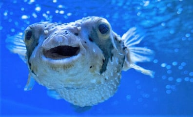

## Kris Morales
Estudiante de la Escuela de Geografía de la [Univeridad de Costa Rica](https://www.ucr.ac.cr/). Y actualmente el estudiante esta cursando los cursos de:

* Analisis de Datos

* Pensamiento Geografico

* Procesamiento de Datos geograficos

### Cursos completados por el estudiante

* Fundamentos de Geografia

* Matematicas apra Geografos I y II

* Cartografia y Tecnicas de Campo
